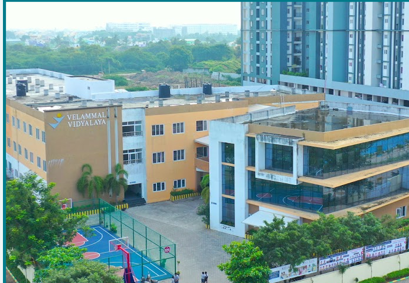

# Ex04 Places Around Me
## Date:13/12/2025 

## AIM
To develop a website to display details about the places around my house.

## DESIGN STEPS

### STEP 1
Create a Django admin interface.

### STEP 2
Download your city map from Google.

### STEP 3
Using ```<map>``` tag name the map.

### STEP 4
Create clickable regions in the image using ```<area>``` tag.

### STEP 5
Write HTML programs for all the regions identified.

### STEP 6
Execute the programs and publish them.

## CODE
```
<!DOCTYPE html>
<html lang="en">
<head>
    <meta charset="UTF-8">
    <meta name="viewport" content="width=device-width, initial-scale=1.0">
    <title>Document</title>
</head>
<body>
    <!-- Image Map Generated by http://www.image-map.net/ -->


<map name="image-map">
    <area target="" alt="Altis Ashraya" title="Altis Ashraya" href="altis.html" coords="535,239,846,117" shape="rect">
    <area target="" alt="Snack Time" title="Snack Time" href="st.html" coords="809,316,49" shape="circle">
    <area target="" alt="Velammall" title="Velammall" href="school.html" coords="1085,135,1127,194,1085,229,967,192,971,125" shape="poly">

    ```
</map>
</body>
</html>

## OUTPUT



## RESULT
The program for implementing image maps using HTML is executed successfully.
